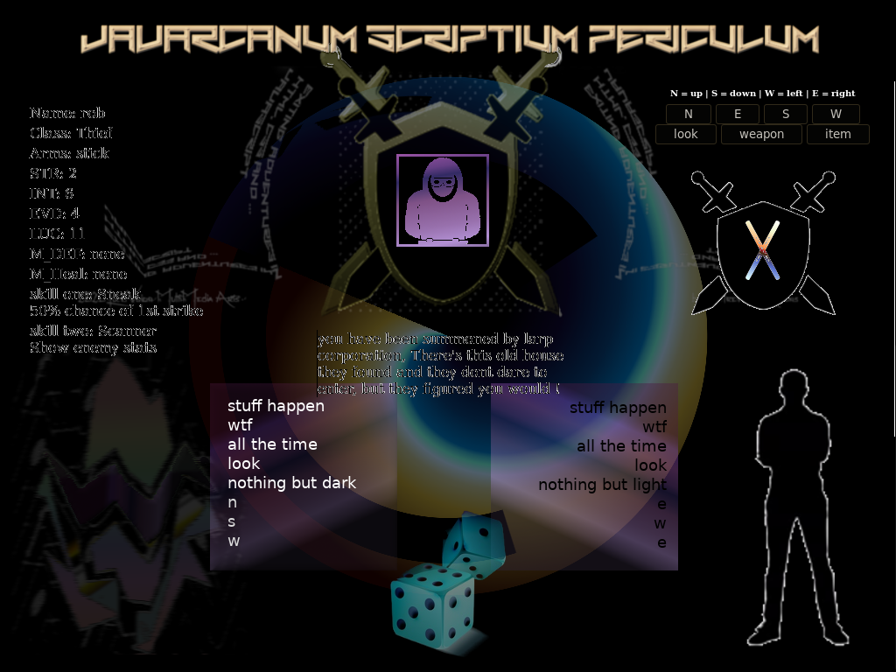
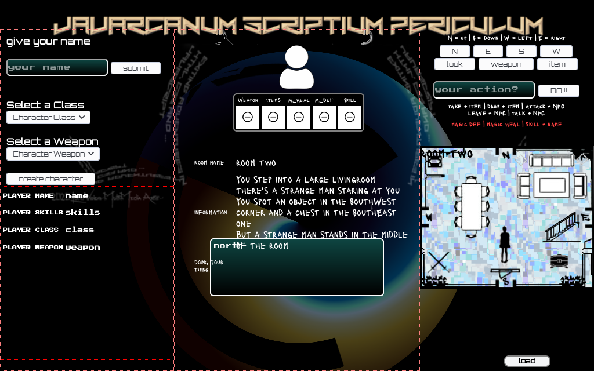
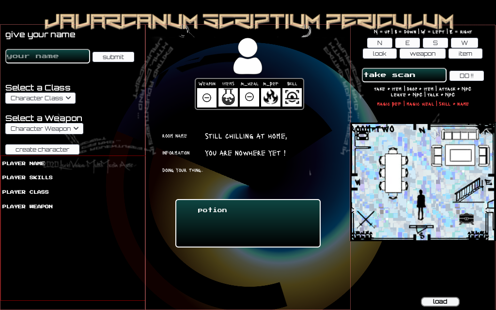

#adventureJS

another attempt at a textadventure / rpg style web game

it is going somewhere sofar

raw idea for a 1 screen layout :

UPDATE: some screenshot of the game taking form:

the goal now is to complete the engine so that rooms, items, npc, enemies, etc can be added and handled.
So any text, characters, images, etc can be changed and added later.

The most important elements:
1. character creation user input handler
2. character stat display wich changes dynamic on game events
3. controls for room movement, controls for room interaction (buttons or text parser)
3. room logic: describe, handle objects and npc objects ,handle exit & entrance logic
4. inventory: add/remove/use management
5. npc: respond to room interaction control elements, handle remove from memory
6. enemy: respond to room interaction control elements, handle remove from memory, handle batlle event
7. battle logic: 
 - I want to base the battle on dicerolls with stat based outcome
  - Healing and Defensive magick spells (i would like a system like mantra type casting(old 				 ultima, where user types learned words or sentences))
   - Skills like 50% chance of 1st attack, sneak past enemy, berserk, non-magic character can learn 		 magic, etc 
8. Storyline: I have no story, every string is made up and for testing.
 - I have an story idea set in our time where some grey/black hat individual gets summoned to a house
  - There he/she gets an job that cant be refused i.e. blackmail scenario
   - The job involves breaking in somewhere, but you get caught and are forced to fight,finish the job 	 and escape unharmed.
    - Magic could be some Bioshock like experimental psychic technology augmentation (that classes who can 		use magic have already)
     - the athmosphere like bladerunner but not to futuristic, a hacker unwillingly pulled into organised 	  crime/intelligence black ops conspiracy story
9. Layout: 1 screen layout with some dynamic content like popups and loading HTML into 
 elements so 		 more elements can be used on a single page.
10. Memory Managment: unload dynamic html page content and remove unused objects from memory so the program 			wont fill up the memory and becomes slow and buggy
11. Save: when you save the state of every object is stored in a file and can be loaded before game start, 		   I was thinking a dedicated screen on page load that is also a preloader
12. Music/Audio playback: Intro theme on save/load/new game screen, maybe some music under an x amount of rooms and devide the story in chapters, each with a theme looping. Some soundFX and Sounds on buttonclicks 		 and events. 
		 I make varied style electronic music and psychedelic techno aswell as ambient/chillout and downtempo experimental stuff:

		 https://soundcloud.com/robvanardenne

I have very little time and I'm not a professional programmer, I've done graphic and webdesign classes around 2003/4, created and managed a couple of websites in this time since I was a party promotor, DJ and performer in the Goa/Psytrance scene and played guitar, bass and keys in amateur bands and collab projects.
Now I work in shipbuilding (long story) and make long hours and weekends and use spare time to work on either music or code but as you can see in my repositories lots of things are unfinished because of this.
Coming back after a long break so I keep notes ,plan ahead in a dev document that I want to put with this repo and comment function usage and this seems to work so I'd like to at least finish the javascript engine and make a blank layout template so you can add any array of items, weapons, classes , rooms, roomobjects, etc.

